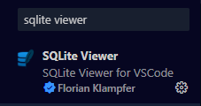

# API Puc-Rio MVP

Irei demonstrar o passo a passo para a instalação da API para o MVP.

---
## Como executar 


Será necessário ter todas as libs python listadas no `requirements.txt` instaladas.
Após clonar o repositório, é necessário ir ao diretório raiz, pelo terminal, para poder executar os comandos descritos abaixo.

```
pip install -r requirements.txt
```

Este comando instala as dependências/bibliotecas, descritas no arquivo `requirements.txt`.

Para executar a API  basta executar:

```
python -m flask run
```

> Obs: Para algumas máquinas talvez seja necessário usar o comando `flask run --host 0.0.0.0 --port 5000`, na minha máquina por exemplo apenas o `python -m flask run` funcionou, mas o resultado é o mesmo.

Em modo de desenvolvimento é recomendado executar utilizando o parâmetro reload, que reiniciará o servidor
automaticamente após uma mudança no código fonte. 

```
python -m flask run --reload
```

Abra o [http://localhost:5000/#/](http://localhost:5000/#/) no navegador para verificar o status da API em execução.

---
Para a visualização no SQLite no Visual Studio é recomendado baixar uma extensão chamada "SQLite Viewer" como mostrado na imagem abaixo.


